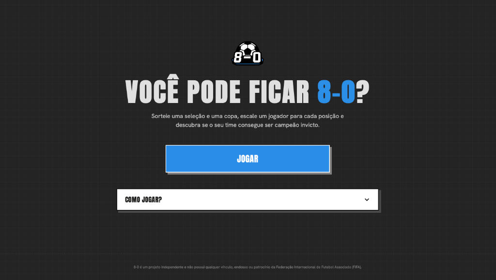
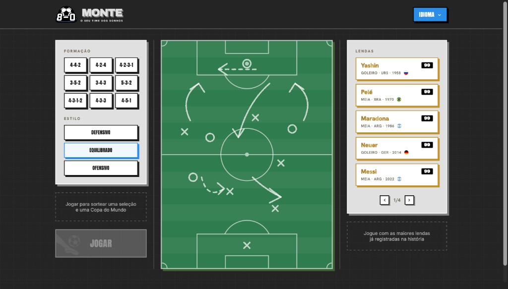

  

<h1 align="center">8-0 Draft / Sorteador</h1>

---

  Um aplicativo web interativo para sortear seleções e copas, além de permitir o "draft" de jogadores para compor o seu esquadrão ideal com um visual de cartas colecionáveis.

  

  
  
  
  

---

## Demonstração do Fluxo do Jogo

### Fluxo Principal do Draft

Interface utilizada para a configuração da formação tática, estilo de jogo, sorteio de seleções/copas e escalação de lendas do futebol mundial.

| 1. Tela de Início | 2. Tela de Jogo / Draft |
| :---: | :---: |
|  |  |

---

## Recursos Principais
- **Sorteio Aleatório**: Sorteie uma Seleção Nacional e uma Copa do Mundo histórica.
- **Multilíngue (8 Idiomas)**: Suporte completo para:
  - Português (PT)
  - Inglês (EN)
  - Espanhol (ES)
  - Francês (FR)
  - Polonês (PL)
  - Italiano (IT)
  - Japonês (JA)
  - Russo (RU)
- **Tática Personalizada**: Escolha de formação tática (como 4-4-2, 4-3-3, 3-5-2, etc.) e estilo de jogo (Defensivo, Equilibrado, Ofensivo).
- **Draft de Jogadores**: Monte seu time selecionando lendas do futebol baseadas na seleção e copa sorteadas.
- **Cartas Colecionáveis ("Cards")**: Visualização do esquadrão em um formato premium de cartas com pontuações.
- **Simulação de Partidas**: Coloque seu time à prova em uma simulação interativa da Copa do Mundo.

---

## Como Usar
Basta abrir o arquivo `index.html` diretamente no seu navegador favorito. Não é necessário nenhum servidor ou build para rodar.

Alternativamente, acesse a versão hospedada no GitHub Pages:
👉 **[Jogar Online](https://thelustosa.github.io/eight-nil/)**

---

## Tecnologias Utilizadas
- **HTML5**: Estruturação semântica da aplicação.
- **CSS3 (Vanilla)**: Estilização responsiva e efeitos visuais premium.
- **JavaScript (Vanilla)**: Lógica de sorteio, internacionalização e simulação das partidas.
